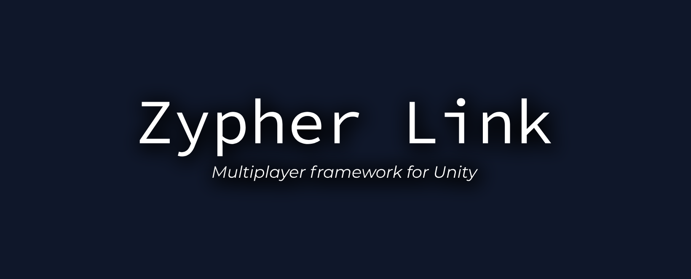

# 

<p align="center">
  
  
  
  
</p>

# ZypherLink

**ZypherLink** is a modern, open-source multiplayer framework for Unity, designed for low-latency, scalable, and secure real-time games. It consists of:

- **SyncServer**: A robust Node.js WebSocket backend for authoritative multiplayer logic, replay logging, anti-cheat, and more.
- **ZeroPing**: A Unity C# client example for rapid prototyping and integration with SyncServer using **NativeWebSocket**

---

## Features

- ⚡ Ultra-low latency WebSocket communication
- 🛡️ Server authority, anti-cheat, and replay logging
- 🧩 Modular, extensible backend (handlers, managers, config)
- 📈 Interactive test panel and stress tools
- 📝 Clear message protocol documentation
- 🐳 Docker-ready for easy deployment

---

## Project Structure

```
ZypherLink/
├── SyncServer/      # Node.js backend (WebSocket server)
│   ├── config/      # Config files (game, rateLimit, server, logger)
│   ├── core/        # Server entrypoint
│   ├── handlers/    # Message handlers (dynamic, validated)
│   ├── managers/    # Player, room, matchmaking managers
│   ├── models/      # Room, Player models
│   ├── utils/       # Anti-cheat, replay logger, uuid, etc.
│   ├── replays/     # Replay logs (auto-generated)
│   ├── logs/        # Server logs (auto-generated)
│   ├── Dockerfile   # Docker build file
│   ├── ...
├── Tests-WebSocket/ # Node.js test clients and panels
│   └── exampleClient.js
├── ZeroPing/        # Unity client example (see folder for details)
├── docker-compose.yml
├── README.md
└── ...
```

---

## Quick Start (SyncServer)

```bash
# 1. Clone the repo
$ git clone https://github.com/superstrellaa/ZypherLink.git
$ cd ZypherLink

# 2. Copy and edit environment variables
$ cp SyncServer/.env.example SyncServer/.env

# 3. Build and run with Docker (recommended)
$ docker-compose up --build

# Or run locally (Node.js 18+ required)
$ cd SyncServer
$ npm install
$ npm start
```

---

## Unity Client (ZeroPing)

- See the `ZeroPing/` folder for a plug-and-play Unity(6.0) example.
- Connects to SyncServer using the documented message protocol.

---

## Documentation

- SyncServer Docs: [`SyncServer/docs/README.md`](SyncServer/docs/README.md)
- Configuration: see files in `SyncServer/config/`
- Test panel: [`Tests-WebSocket/exampleClient.js`](Tests-WebSocket/exampleClient.js)

---

## Contributing

Pull requests and issues are welcome! Please open an issue for bugs, ideas, or questions.

---

## License

MIT © superstrellaa

---

<p align="center">
  <sub>Made with ❤️ for the Unity multiplayer community.</sub>
</p>
