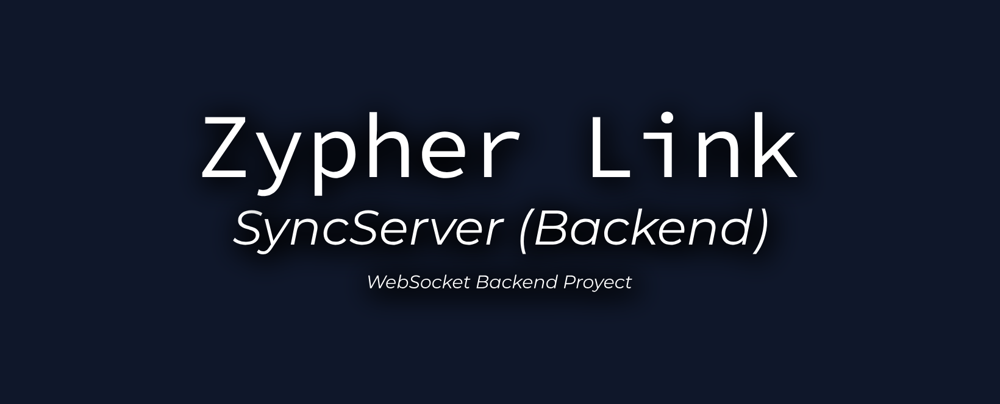

# 

<p align="center">
  
  
  
  
</p>

# SyncServer

**SyncServer** is a modern, modular Node.js backend for real-time multiplayer games, designed to work seamlessly with Unity clients (see [ZeroPing](../ZeroPing/)).

- ⚡ Uses WebSocket for ultra-low latency, bidirectional communication
- 🛡️ Server-authoritative logic, anti-cheat, and replay logging
- 🧩 Modular architecture: handlers, managers, config, utils
- 📈 Built-in rate limiting, validation (Joi), and robust logging (Winston)
- 🐳 Docker-ready for easy deployment

---

## Features

- WebSocket server (no HTTP/REST)
- Dynamic message handler loading
- Per-player rate limiting (configurable)
- Joi schema validation for all messages
- Server authority: only valid, in-room actions are processed
- Anti-cheat system (configurable)
- Per-room replay logging
- Matchmaking and room management
- Interactive test panel for development

---

## Quick Start

```bash
# 1. Copy and edit environment variables
$ cp .env.example .env

# 2. Build and run with Docker (recommended)
$ docker-compose up --build

# Or run locally (Node.js 18+ required)
$ npm install
$ npm start
```

---

## Project Structure

```
SyncServer/
├── config/      # Config files (game, rateLimit, server, logger)
├── core/        # Server entrypoint
├── handlers/    # Message handlers (dynamic, validated)
├── managers/    # Player, room, matchmaking managers
├── models/      # Room, Player models
├── utils/       # Anti-cheat, replay logger, uuid, etc.
├── replays/     # Replay logs (auto-generated)
├── logs/        # Server logs (auto-generated)
├── Dockerfile   # Docker build file
├── ...
```

---

## Configuration

- All config is in the `config/` folder (game, rate limit, server, logger)
- Environment variables via `.env` (see `.env.example`)

---

## Protocol & Documentation

- Docs: [`docs/README.md`](docs/README.md)
- Test panel: [`../Tests-WebSocket/exampleClient.js`](../Tests-WebSocket/exampleClient.js)

---

## Contributing

Pull requests and issues are welcome! Please open an issue for bugs, ideas, or questions.

---

## License

MIT © superstrellaa

---

<p align="center">
  <sub>SyncServer — Fast, Secure, and Simple Multiplayer Backend for Unity & Node.js</sub>
</p>
