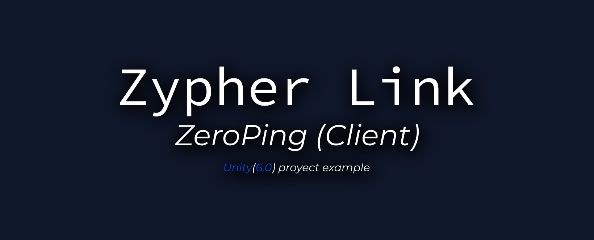

# 

<p align="center">
  
  
  
</p>

# ZeroPing

**ZeroPing** is a Unity 6.0 sample project demonstrating how to use the [SyncServer](../SyncServer/) backend for real-time multiplayer games.

- 🚀 **Unity 6.0** project (no legacy, fully up-to-date)
- 🧩 Example of integrating with SyncServer (Node.js WebSocket backend)
- 🌐 Uses [NativeWebSocket](https://github.com/endel/NativeWebSocket) for WebSocket communication
- 🟢 **No extra DLLs required**: relies on Unity's built-in `System.Net.WebSocket` (C# only)
- 💡 Clean, readable C# code for rapid prototyping

---

## Features

- Connects to SyncServer via WebSocket (see [SyncServer README](../SyncServer/README.md))
- Sends and receives real-time messages (move, ping, etc.)
- Minimal, easy-to-understand codebase
- No external DLL dependencies—just C# and NativeWebSocket

---

## Quick Start

1. **Open in Unity 6.0**
   - Open the `ZeroPing` folder as a project in Unity 6.0 or newer.
2. **Install NativeWebSocket**
   - Use the Unity Package Manager to add [NativeWebSocket](https://github.com/endel/NativeWebSocket) (or import via `.unitypackage`).
3. **Configure SyncServer**
   - Make sure [SyncServer](../SyncServer/) is running (see its README for setup).
   - Update the WebSocket URL in the ZeroPing code if needed (default: `ws://localhost:3000`).
4. **Play!**
   - Press Play in Unity Editor. You should see connection, movement, and real-time multiplayer in action.

---

## Project Structure

```
ZeroPing/
├── Assets/
│   ├── Scripts/         # C# scripts for WebSocket, player, etc.
│   └── ...
├── ProjectSettings/
└── ...
```

---

## Why ZeroPing?

- **Unity 6.0 native**: No legacy code, no DLLs, no hacks—just modern Unity and C#
- **Reference implementation**: Shows how to connect, send, and receive messages with SyncServer
- **No vendor lock-in**: Uses open-source, community-maintained libraries

---

## License

MIT. See [LICENSE](../LICENSE).
